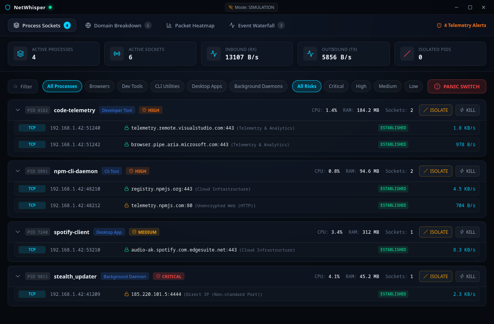

# NetWhisper: Phase 1 Testing Documentation

This document records the automated testing and validation results for Phase 1: Backend Core and Telemetry Engine.



---

## 1. Test Suite Summary

- **Test Target**: Python Telemetry Daemon (Socket Extraction, Reverse DNS, Secret Redactor, Sandbox Manager, Scenario Generator, and FastAPI Endpoints).
- **Test Runner**: `pytest v9.1.1` under Python 3.14.7.
- **Test File**: `tests/test_phase1_backend.py`.
- **Execution Command**: `.venv/bin/pytest tests/test_phase1_backend.py -v`.
- **Overall Result**: **7 Passed / 0 Failed (100% Success Rate)**.
- **Total Duration**: 0.54 seconds.

---

## 2. Detailed Test Case Results

| Test Function | Target Component | Description & Rationale | Status |
| :--- | :--- | :--- | :--- |
| `test_hex_conversion` | `socket_engine.py` | Converts little-endian hex network bytes (e.g. `0100007F:0050`) to standard IPv4 and port numbers. Asserts `127.0.0.1:80`. | **PASSED** |
| `test_privacy_analyzer_signatures` | `privacy_analyzer.py` | Validates regex signature matching against known telemetry domains (`telemetry.cursor.sh`) and unencrypted endpoints. Asserts correct categorization and risk scoring. | **PASSED** |
| `test_secret_scrubber` | `privacy_analyzer.py` | Scans command-line strings containing mock Bearer tokens and passwords. Asserts that secrets are redacted to `[REDACTED_TOKEN]` and `[REDACTED_PASSWORD]`. | **PASSED** |
| `test_sandbox_system_pid_protection` | `sandbox_manager.py` | Asserts that PID 0, PID 1, and NetWhisper's own PID cannot be terminated or isolated, returning `403 Forbidden`. | **PASSED** |
| `test_sandbox_pid_validation` | `sandbox_manager.py` | Fuzzes PID input parser with negative values, strings, and booleans. Asserts that invalid inputs are rejected cleanly. | **PASSED** |
| `test_scenario_generator` | `scenario_generator.py` | Generates simulated traffic ticks with fluctuating byte counts and verifies that isolated processes transition to `BLOCKED`. | **PASSED** |
| `test_fastapi_endpoints` | `main.py` | Tests REST endpoints (`/api/status`, `/api/mode`, `/api/sandbox/isolate`, `/api/panic`) and verifies expected HTTP 200/403 status codes. | **PASSED** |

---

## 3. Terminal Execution Log

```
============================= test session starts ==============================
platform linux -- Python 3.14.7, pytest-9.1.1, pluggy-1.6.0 -- /home/amanap/Documents/GitHub/NetWhisper/.venv/bin/python3
rootdir: /home/amanap/Documents/GitHub/NetWhisper
plugins: anyio-4.14.2
collected 7 items

tests/test_phase1_backend.py::test_hex_conversion PASSED                 [ 14%]
tests/test_phase1_backend.py::test_privacy_analyzer_signatures PASSED    [ 28%]
tests/test_phase1_backend.py::test_secret_scrubber PASSED                [ 42%]
tests/test_phase1_backend.py::test_sandbox_system_pid_protection PASSED  [ 57%]
tests/test_phase1_backend.py::test_sandbox_pid_validation PASSED         [ 71%]
tests/test_phase1_backend.py::test_scenario_generator PASSED             [ 85%]
tests/test_phase1_backend.py::test_fastapi_endpoints PASSED              [100%]

========================= 7 passed, 1 warning in 0.54s =========================
```
